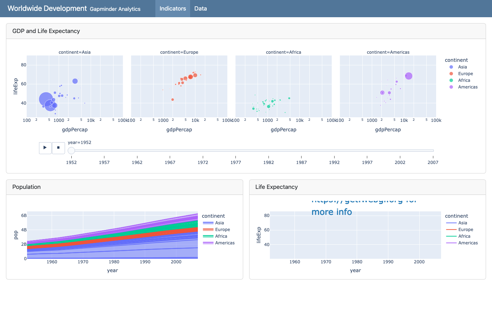
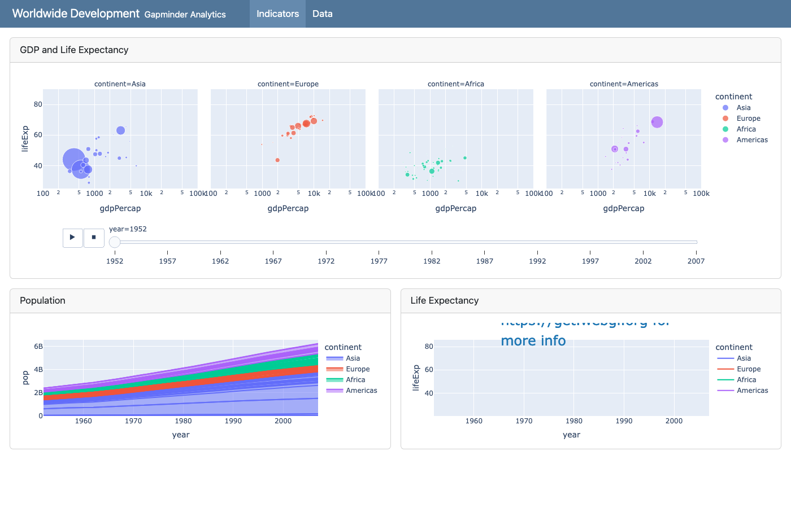
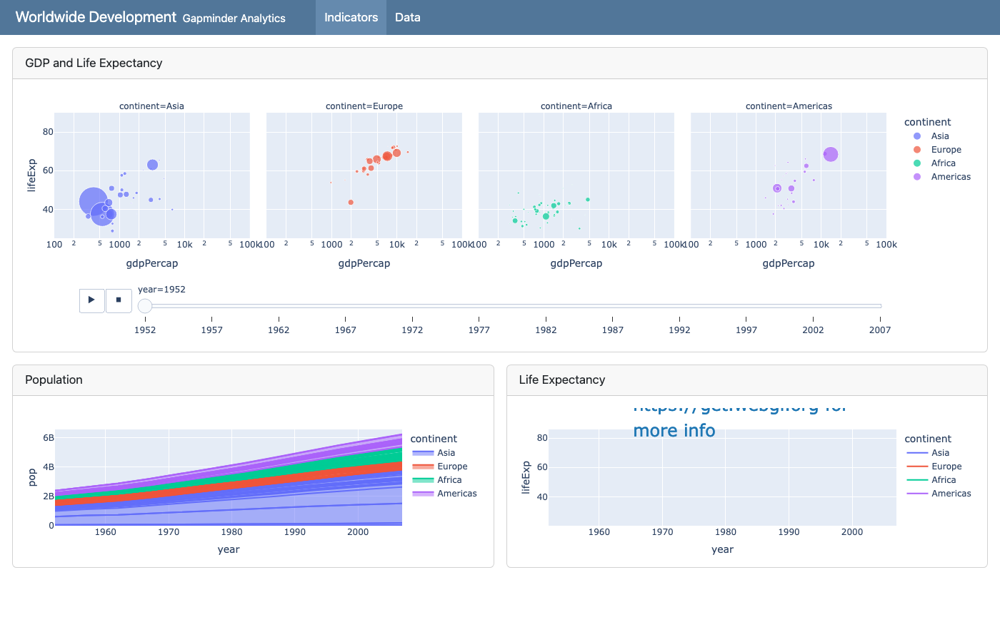
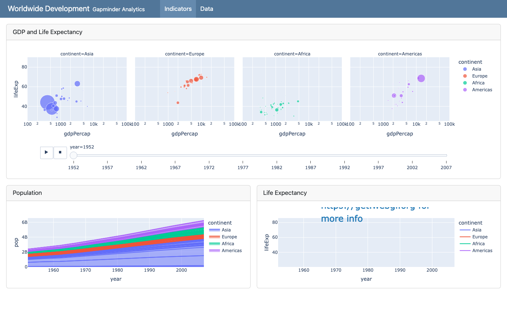
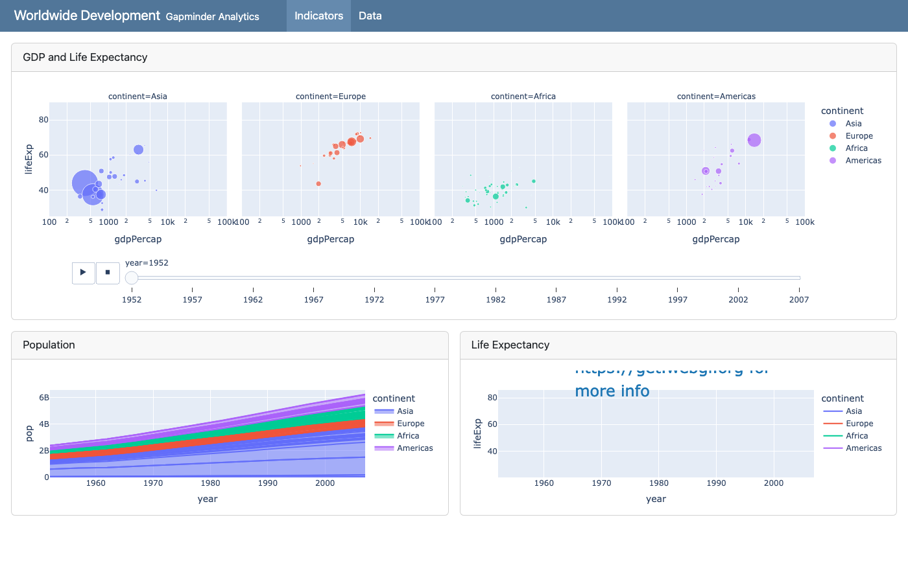
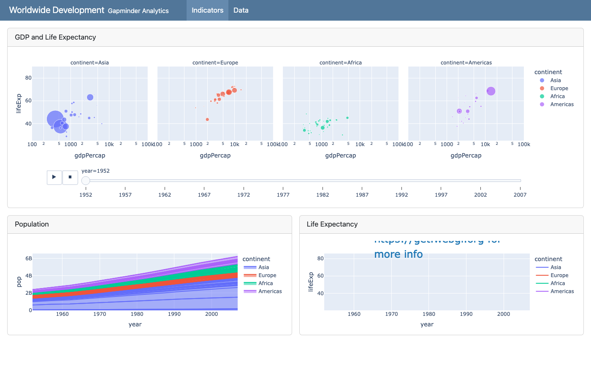
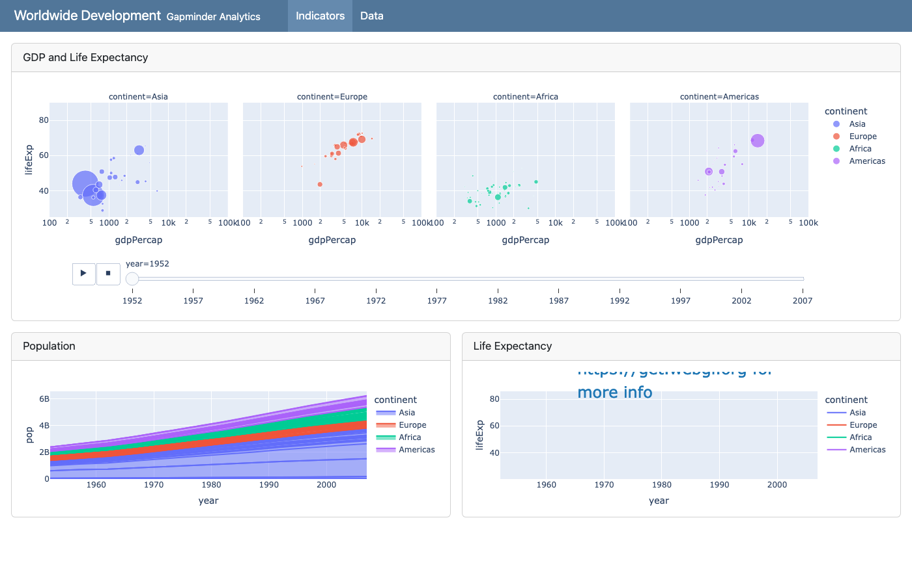
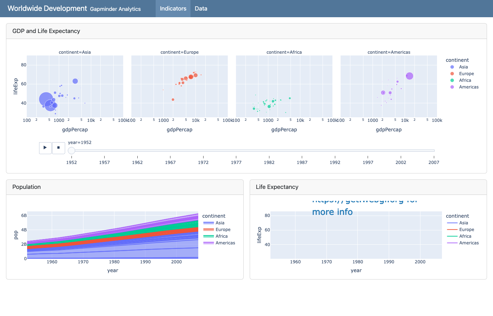
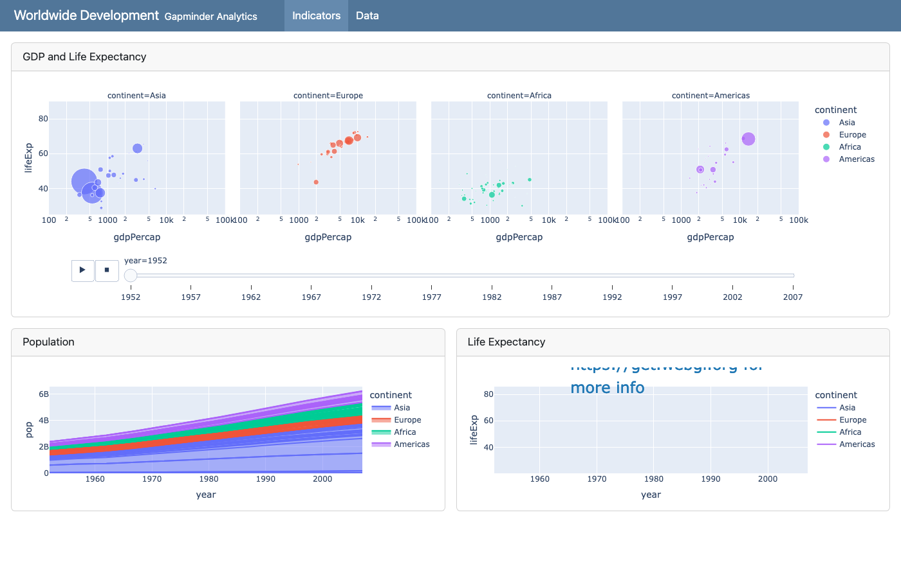

## 🏆 Podio

::: {.grid}

::: {.g-col-12 .g-col-md-4}
### 🥇 [LinuxitOS](https://hackods.github.io/HackODS2026_linuxitOS/)

  <iframe src="https://hackods.github.io/HackODS2026_linuxitOS/" loading="lazy"></iframe>

:::

::: {.g-col-12 .g-col-md-4}
### 🥈 [Trio Tristeza](https://hackods.github.io/HackODS2026_TrioTristeza/)

  <iframe src="https://hackods.github.io/HackODS2026_TrioTristeza/" loading="lazy"></iframe>

:::

::: {.g-col-12 .g-col-md-4}
### 🥉 [Abejas Astutas](https://hackods.github.io/HackODS2026_AbejasAstutas/)

  <iframe src="https://hackods.github.io/HackODS2026_AbejasAstutas/" loading="lazy"></iframe>

:::

:::

## Finalistas

::: {.grid}

::: {.g-col-12 .g-col-sm-6 .g-col-md-4 .g-col-lg-3}

**Bladerunners**
:::

::: {.g-col-12 .g-col-sm-6 .g-col-md-4 .g-col-lg-3}

**Código Guinda**
:::

::: {.g-col-12 .g-col-sm-6 .g-col-md-4 .g-col-lg-3}

**DatofilODS**
:::

::: {.g-col-12 .g-col-sm-6 .g-col-md-4 .g-col-lg-3}

**DERRE**
:::

::: {.g-col-12 .g-col-sm-6 .g-col-md-4 .g-col-lg-3}

**EmprendeIA**
:::

::: {.g-col-12 .g-col-sm-6 .g-col-md-4 .g-col-lg-3}

**HuerfanitosUTM**
:::

::: {.g-col-12 .g-col-sm-6 .g-col-md-4 .g-col-lg-3}

**linuxitOS**
:::

::: {.g-col-12 .g-col-sm-6 .g-col-md-4 .g-col-lg-3}

**Lobo Ensambladores**
:::

::: {.g-col-12 .g-col-sm-6 .g-col-md-4 .g-col-lg-3}

**MareaDeDatODS**
:::

::: {.g-col-12 .g-col-sm-6 .g-col-md-4 .g-col-lg-3}

**PatosClimaticODS**
:::

::: {.g-col-12 .g-col-sm-6 .g-col-md-4 .g-col-lg-3}

**PCABoys**
:::

::: {.g-col-12 .g-col-sm-6 .g-col-md-4 .g-col-lg-3}

**Pumatécnicos**
:::

::: {.g-col-12 .g-col-sm-6 .g-col-md-4 .g-col-lg-3}

**Tlamatipohua**
:::

::: {.g-col-12 .g-col-sm-6 .g-col-md-4 .g-col-lg-3}

**Trío tristeza**
:::

::: {.g-col-12 .g-col-sm-6 .g-col-md-4 .g-col-lg-3}

**Typers**
:::

::: {.g-col-12 .g-col-sm-6 .g-col-md-4 .g-col-lg-3}

**UPIIT Machine**
:::

::: {.g-col-12 .g-col-sm-6 .g-col-md-4 .g-col-lg-3}

**Voces ODS 2030**
:::

:::
