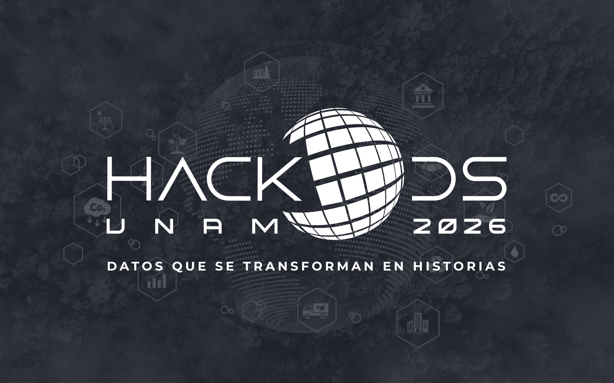
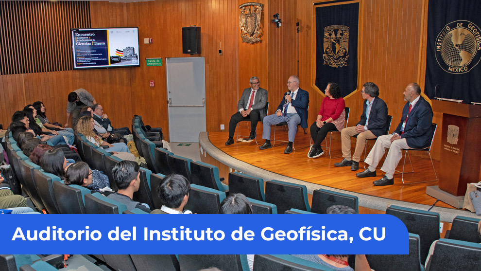
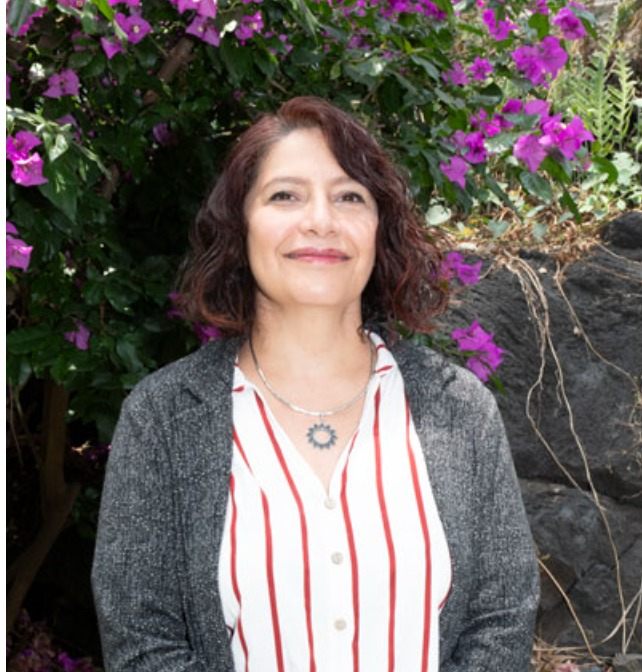
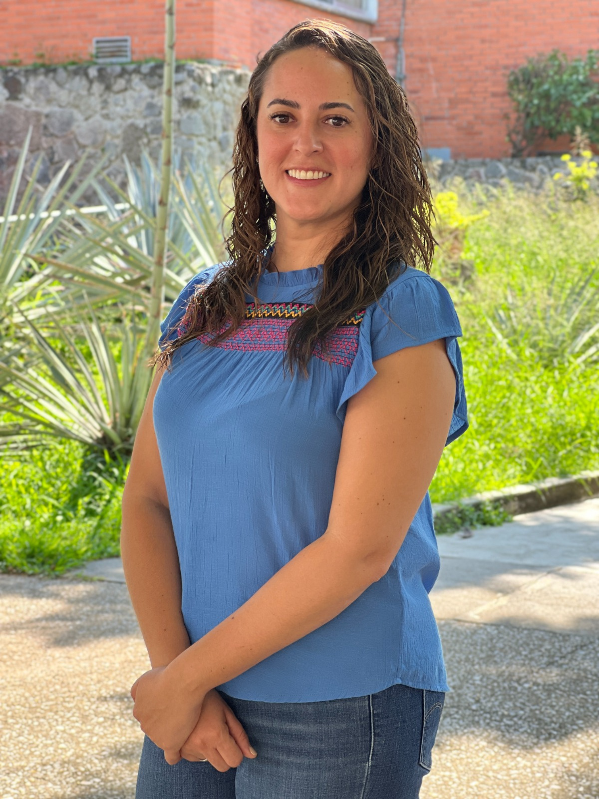
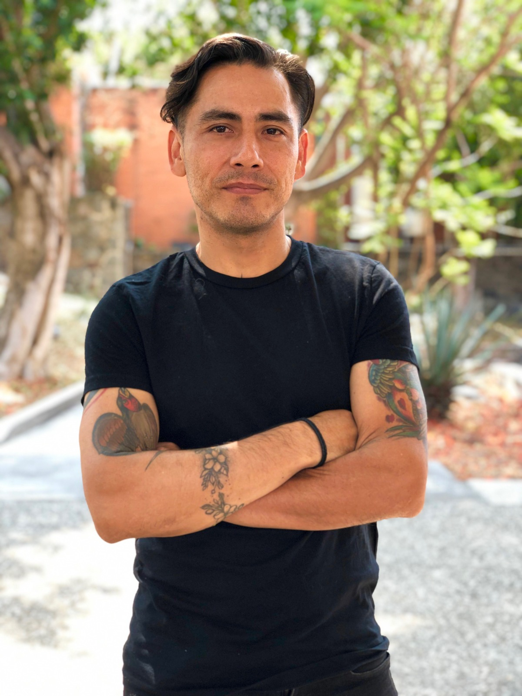

::: {.hero}
{.hero-image alt="Portada HackODS"}
:::

::: {.principal}
# HackODS es ... {#hackods}
   
<!-- 
#### Transformando datos abiertos en soluciones sostenibles {.frases}

¿Te apasionan los datos, las visualizaciones y el desarrollo sostenible?  
¿Te interesa poner tu talento al servicio de las grandes causas del país?  

#### ¡Este hackatón es para ti! {.frases2} -->

El primer hackatón de la UNAM para transformar datos abiertos en soluciones sostenibles. 
Es una experiencia única de innovación y colaboración universitaria que busca convertir los desafíos de los Objetivos de Desarrollo Sostenible (ODS) en narrativas visuales accesibles, usando herramientas tecnológicas de código abierto y datos públicos.

Durante varias etapas de formación, mentoría y creación, equipos multidisciplinarios diseñarán tableros interactivos que visibilicen el progreso (o retroceso) de México en el cumplimiento de los ODS.

Si te apasionan los datos, las visualizaciones, el desarrollo sostenible y te interesa poner tu talento al servicio de las grandes causas del país... 

¡El HackODS UNAM 2026 es para ti!

 
---  

## Convocatoria {#convocatoria}

### Objetivo General
Impulsar la creación de tableros interactivos e historias visuales basadas en datos abiertos, que promuevan soluciones informadas e innovadoras para los retos del desarrollo sostenible en México. 

### Objetivos Específicos
- Fomentar el pensamiento crítico y creativo a través del análisis y visualización de datos.
- Potenciar el uso de tecnologías abiertas para el bien común.
- Generar redes de colaboración entre estudiantes de distintas disciplinas.
- Visibilizar las brechas y avances en torno a los ODS a nivel nacional y regional.

### Bases de Participación

#### 1) ¿Quiénes pueden participar?
- Estudiantes con inscripción vigente en licenciatura, maestría o doctorado de cualquier institución educativa mexicana.
- Equipos de tres integrantes como máximo, con al menos un hombre y una mujer.
- Se recomienda la integración de equipos multidisciplinarios (por ejemplo: ingeniería, ciencias sociales, diseño, matemáticas, comunicación).

#### 2) Registro {#registro}
- Llena el formulario en: [XXX]
- Adjunta comprobante de inscripción vigente de cada integrante.
- Cuota de recuperación: $500 MXN por equipo (transferencia bancaria o plataforma indicada).

#### 3) Categoría
- Categoría única: Todos los equipos competirán bajo los mismos criterios de evaluación.
 
 
## Cronograma General {#cronograma}

| Evento                                         | Fecha                    | Detalles                                               |
|:-----------------------------------------------|:-------------------------|:-------------------------------------------------------|
| Publicación de la convocatoria   y apertura registro             | 12 de enero de 2026      | Disponible en [Agregar sitio web oficial]          |
| Evento híbrido transmitido y formación de equipos | 5 de febrero de 2026   | Sede: [Agregar sede] – Horario: [Agregar hora] |
| Cierre del registro                            | 13 de febrero de 2026    | Hora límite: 18:00 h                             |
| Capacitación y mentorías                       | 16 de febrero -- mayo    | Talleres en línea: ODS, datos abiertos, UX/UI          |
| Evento final y premiación                      | 25 y 26 de junio de 2026 | Presentación y evaluación de proyectos        
         |

## Criterios de Evaluación {#criterios}
Los proyectos serán evaluados por un jurado experto con base en los siguientes rubros:

- Calidad técnica: uso correcto y eficaz de herramientas y datos.
- Creatividad: originalidad en la visualización y narrativa.
- Impacto: relevancia del tablero para visibilizar problemáticas reales.
- Accesibilidad y diseño: claridad, inclusión y facilidad de interpretación.

## Premios {#premios}
- 1er. lugar: Tres laptops Dell XPS 13 (valor aproximado $25,000 MXN c/u).
- 2do. lugar: Tres kits Raspberry Pi Modelo 5, 8GB RAM.
- 3er. lugar: Tres Chromebooks Acer Spin 311.

Además:

- Publicación de proyectos destacados en los portales oficiales de la UNAM.
- Constancias de participación para todos los equipos finalistas.

## Jurado *(por anunciar)* {#jurado}

**Integrantes (PA):**

- [Por anunciar]
- [Por anunciar]
- [Por anunciar]

> El fallo del jurado será **definitivo e inapelable**.

## Motivos de Descalificación {#descalificacion}
- Incumplimiento de los requisitos establecidos en la convocatoria.
- Plagio o uso indebido de datos no verificados.
- Conductas contrarias a la ética (discriminación, fraude, etc.).
- Inasistencia injustificada al evento final.

## Premiación {#entrega}
**20–21 de noviembre de 2025**  
Sede: Auditorio del Instituto de Geofísica, CU

{fig-align="center" width=50%}

**Requisitos:**

- Presentar identificación oficial (INE, pasaporte o credencial de estudiante vigente).
- Asistir personalmente o con representante designado.

## Llamado a la Acción {#cta}
#### ¡Haz que los datos hablen! {.frases} 
Transforma estadísticas en soluciones, conecta ideas y crea impacto real.  
**Inscríbete y sé parte del cambio.** → [Ir al registro](#registro)

## Organizadores {#Organizadores}

 

  <figure class="organizer-card">
    
    <figcaption>
      Maricarmen Hernández
      Logística
      Instituto de Geofísica, UNAM
      <a class="organizer-email" href="mailto:planeacion@igeofisica.unam.mx ">planeacion@igeofisica.unam.mx </a>
    </figcaption>
  </figure>

  <figure class="organizer-card">
    
    <figcaption>
      Luis Miguel de la Cruz 
      Mentor de Storytelling
      Instituto de Geofísica, UNAM
      <a class="organizer-email" href="mailto:luiggi@igeofisica.unam.mx ">luiggi@igeofisica.unam.mx </a>
    </figcaption>
  </figure>

  <figure class="organizer-card">
    
    <figcaption>
      Daniela Juárez
      Patrocinios
      Instituto de Energías Renovables, UNAM
      <a class="organizer-email" href="mailto:hackods@ier.unam.mx ">hackods@ier.unam.mx</a>
    </figcaption>
  </figure>  
 
  <figure class="organizer-card">
    
    <figcaption>
      Guillermo Barrios
      Quarto y tableros
      Instituto de Energías Renovables, UNAM
      <a class="organizer-email" href="mailto:gbv@ier.unam.mx">gbv@ier.unam.mx</a>
    </figcaption>
  </figure>

 


## Contacto {#contacto}
¿Tienes dudas o necesitas apoyo técnico?  
👉 Escríbenos a [hackods@ier.unam.mx](mailto:hackods@ier.unam.mx)

#### ¡Síguenos en redes! {.frases2}
 **@HackODS_UNAM** en Twitter e Instagram.

:::

::: {.footer}
:::
